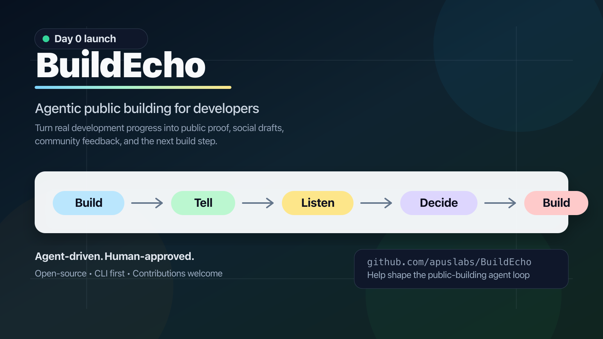

<div align="center">
  

  # BuildEcho

  **An agentic open-source growth loop inside every repo.**

  Help open-source projects **build**, **publish**, **listen**, and **improve**
  through autonomous agent loops that stay truthful, reviewable, and
  human-approved.

  [](LICENSE)
  [](docs/PUBLIC_BUILD_DAY_0.md)
  [](docs/AGENT_HARNESS.md)

  [Vision](#-vision) • [Quick Start](#-quick-start) • [How It Works](#-how-it-works) • [Agent Team](#-agent-team) • [Contributing](#-contributing)
</div>

---

## Vision

BuildEcho exists to help open-source projects compound.

Most projects do not fail because nothing is being built. They fail because the
work stays invisible, the story stays unclear, feedback arrives too late, and
the next build step is not connected to real community signals.

BuildEcho turns a repository into a small agentic company:

- A builder loop that understands real code progress.
- A story loop that turns proof into useful public updates.
- A community loop that listens for demand, confusion, and objections.
- A strategy loop that converts feedback into the next build step.
- A governance loop that blocks hype, spam, and unsafe automation.

The long-term goal is not just to generate posts. The goal is to give every
open-source project a 24-hour agentic operating loop for building, explaining,
learning, and growing.

```text
Build -> Prove -> Publish -> Listen -> Decide -> Build
```

BuildEcho should become the repo-native system that helps a project earn trust,
contributors, users, and momentum without turning public building into spam.

See [docs/VISION.md](docs/VISION.md).

---

## Why BuildEcho?

Most developers build every day, but their progress stays invisible.

- Commits never become public proof.
- Bug fixes never become learning.
- Demos never become distribution.
- User feedback never becomes the next build loop.
- Developers know they should build in public, but the workflow is manual.

**BuildEcho solves this with a governed agentic loop:**

- Read real project activity.
- Extract what is worth sharing.
- Attach proof before claims.
- Draft updates for different channels.
- Discover feedback, questions, and possible users.
- Recommend the next build, demo, benchmark, or doc improvement.
- Keep humans in the publishing loop.
- Learn from community response.

BuildEcho is not a posting bot. It is an operating loop for open-source growth:

```text
Build -> Prove -> Publish -> Listen -> Decide -> Build
```

---

## How It Works

```text
┌────────────────────┐
│  Your repository   │
│ commits / PRs /    │
│ issues / releases  │
└─────────┬──────────┘
          │
          v
┌──────────────────────────────────────────┐
│          BuildEcho Agent Team            │
│  • understand real progress              │
│  • find proof and public signals         │
│  • draft channel-specific updates        │
│  • discover feedback and demand          │
│  • recommend the next build step         │
│  • check truthfulness, safety, and spam  │
└─────────┬────────────────────────────────┘
          │
          v
┌──────────────────────────────────────────┐
│            Human review                  │
│  approve / edit / skip                   │
└─────────┬────────────────────────────────┘
          │
          v
┌──────────────────────────────────────────┐
│  Public artifacts                        │
│  build log / social drafts / video plan  │
│  GitHub issue or discussion suggestions  │
└─────────┬────────────────────────────────┘
          │
          v
┌──────────────────────────────────────────┐
│  Feedback becomes the next build step    │
└──────────────────────────────────────────┘
```

---

## Quick Start

BuildEcho is currently a local, repo-native CLI.

```bash
git clone https://github.com/apuslabs/BuildEcho.git
cd BuildEcho
npm install
npm run build
npm run dev -- init
npm run dev -- daily
```

When published as a package, the intended usage is:

```bash
npx buildecho init
npx buildecho daily
npx buildecho draft
```

BuildEcho keeps project memory in your repository:

```text
.buildecho/
  config.json       project settings
  context.md        current project context for humans and agents
  memory.md         long-running public-building memory
  build-logs/       local build logs
  drafts/           social drafts
  feedback/         community feedback summaries
  metrics/          response and growth signals
  prompts/          project-specific prompts
```

---

## What BuildEcho Generates

A daily run should produce:

| Output | Purpose |
| --- | --- |
| Build log | A truthful record of what changed |
| Public angles | The 1-3 most useful things to share |
| Proof list | Commits, PRs, docs, demos, metrics, or feedback |
| X draft | Short public progress update |
| X thread | Deeper build-in-public narrative |
| LinkedIn draft | More reflective professional update |
| Reddit / HN draft | Discussion-first community post |
| Discord update | Concise update for existing followers |
| Next build step | What to build, document, benchmark, or ask next |
| Quality check | Flags hype, unsupported claims, or risky content |

Example:

```markdown
# Build Log - 2026-06-24

## Real Progress
- Added the first CLI commands: init, daily, draft.
- Documented the Build -> Tell -> Listen -> Decide -> Build loop.
- Added agent harness governance for future contributors.

## Public Angle
We are starting BuildEcho in public, using the same loop we want the product to
provide for other developers.

## Proof
- README.md
- docs/AGENT_LOOP.md
- docs/AGENT_HARNESS.md
- src/cli.ts

## X Draft
Starting BuildEcho today: an agentic public-building loop for developers.

The goal is simple:
turn real development progress into public proof, social drafts, community
feedback, and the next build step.

Agent-driven. Human-approved.
```

---

## Product Principles

BuildEcho should:

- Tell the truth.
- Prefer proof over claims.
- Avoid spam.
- Respect each community.
- Keep humans in the approval loop.
- Learn from feedback.

BuildEcho should not:

- Invent progress.
- Inflate ordinary work into fake breakthroughs.
- Publish without human approval.
- Automate spam, mass replies, or unsolicited mentions.
- Position itself as a generic social media bot.

---

## Agent Team

BuildEcho presents one product surface, but works like a governed agent team
inside the repository.

| Agent | Role |
| --- | --- |
| Orchestrator Agent | Owns the loop, chooses work, and merges outputs |
| Builder Agent | Reads commits, PRs, issues, releases, docs, and demos |
| Proof Agent | Connects every claim to commits, diffs, screenshots, metrics, or feedback |
| Story Agent | Writes build logs, social drafts, launch notes, and video scripts |
| Growth Agent | Finds relevant communities, projects, issues, and potential users |
| Community Agent | Summarizes external feedback, objections, and contributor signals |
| Strategy Agent | Recommends the next build, demo, benchmark, or doc improvement |
| Governor Agent | Blocks unsupported claims, unsafe outreach, spam, and policy violations |

See [docs/AGENT_LOOP.md](docs/AGENT_LOOP.md).

---

## Agent Harness

BuildEcho is designed so humans and coding agents can both continue the project.

If you are a coding agent, read these first:

1. [docs/AGENT_HARNESS.md](docs/AGENT_HARNESS.md)
2. [.buildecho/context.md](.buildecho/context.md)
3. [docs/VISION.md](docs/VISION.md)
4. [docs/AGENT_LOOP.md](docs/AGENT_LOOP.md)
5. [docs/PROMPT.md](docs/PROMPT.md)
6. [docs/ROADMAP.md](docs/ROADMAP.md)

The harness defines:

- Required context files
- Target function
- Agent roles and permission boundaries
- Allowed early contributions
- Verification protocol
- Human approval boundary
- Handoff protocol

---

## Roadmap

### Phase 0: Make the idea legible

- README
- Vision document
- Agent loop documentation
- First system prompt
- Contribution guide
- Agent harness governance
- Minimal CLI

### Phase 1: Local CLI

- Read local git history
- Generate useful build logs
- Generate social draft structures
- Add quality checks for unsupported claims

### Phase 2: GitHub Native

- Read commits, PRs, issues, and releases through GitHub API
- Generate daily build logs through GitHub Actions
- Open draft PRs or issues with suggested public updates

### Phase 3: Agent Team and Governance

- Orchestrator, Builder, Proof, Story, Growth, Community, Strategy, and Governor agents
- Repo-local policies for autonomous, approval-required, and forbidden actions
- Human approval queue for publishing and outreach
- Quality gates for claims, spam risk, tests, tone, and community fit

### Phase 4: Review and Publish

- Human approval queue
- Optional X, LinkedIn, Discord, Reddit integrations
- Draft scheduling
- Channel-specific style guides

### Phase 5: Feedback Loop

- Collect comments, stars, clicks, signups, and issues
- Summarize feedback into product insights
- Recommend next build actions

### Phase 6: Daily Video Loop

- Generate demo scripts, shot lists, cover images, and subtitles
- Produce short video drafts from real progress
- Keep video publishing human-approved

See [docs/ROADMAP.md](docs/ROADMAP.md).

---

## Repository Status

BuildEcho is intentionally early. Day 0 is about making the idea legible:

- Clear story
- Clear loop
- Clear agent harness
- Minimal CLI
- Public roadmap

See [docs/PUBLIC_BUILD_DAY_0.md](docs/PUBLIC_BUILD_DAY_0.md).

---

## Contributing

Contributions are welcome in code, prompts, docs, examples, and workflows.

Start with [CONTRIBUTING.md](CONTRIBUTING.md).

Good first contributions:

- Improve `buildecho daily` output.
- Add local git activity collectors.
- Add prompt templates for agent roles.
- Add examples from real developer projects.
- Add quality checks for unsupported claims.

---

## License

MIT
